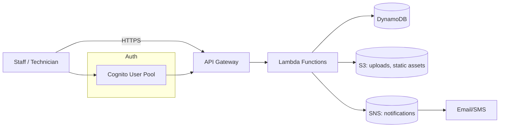
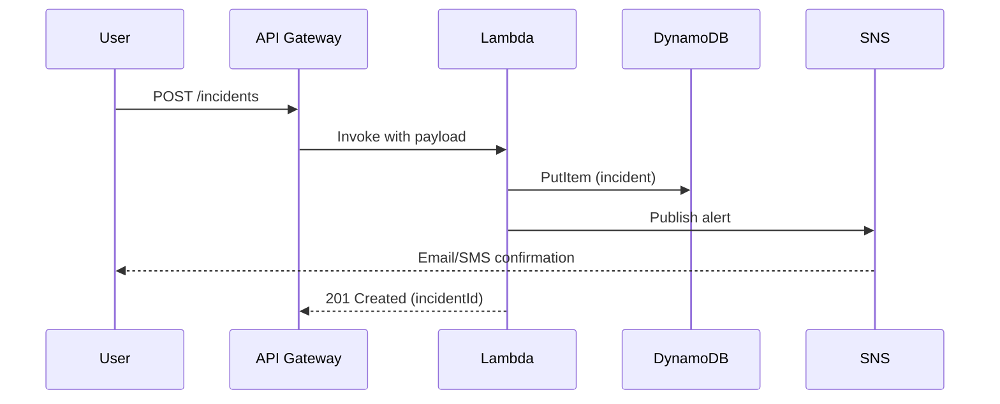

# Architecture

```mermaid
flowchart LR
  User[Staff / Technician] -->|HTTPS| APIGW[API Gateway]
  APIGW --> LBD[Lambda Functions]
  LBD --> DB[(DynamoDB)]
  LBD --> S3[(S3: uploads, static assets)]
  LBD --> SNS[(SNS: notifications)]
  SNS --> Email[Email/SMS]
  subgraph Auth
    Cognito[Cognito User Pool]
  end
  User --> Cognito
  Cognito --> APIGW
```

## Sequence: Create Incident

```mermaid
sequenceDiagram
  participant U as User
  participant G as API Gateway
  participant L as Lambda
  participant D as DynamoDB
  participant N as SNS
  U->>G: POST /incidents
  G->>L: Invoke with payload
  L->>D: PutItem (incident)
  L->>N: Publish alert
  N-->>U: Email/SMS confirmation
  L-->>G: 201 Created (incidentId)
```
