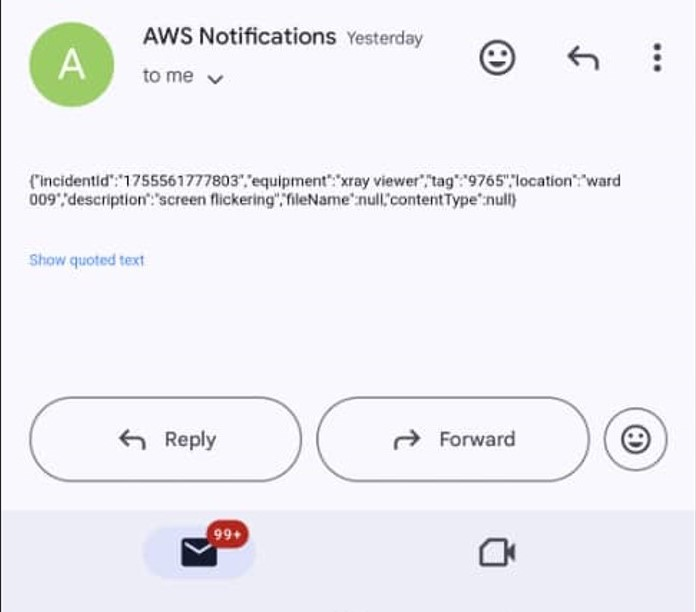

# AWS Hospital Equipment Incident Reporting & Alerting System

This is a hospital equipment incident reporting and alerting system I built using AWS services. The goal is to make it easy for hospital staff to report equipment faults and for the system to automatically notify the right people while keeping a record of incidents.

## Features
- Frontend hosted on **S3** with **CloudFront** for fast access
- **Cognito** handles user signup, login and authentication
- **API Gateway** connects the frontend to the backend
- **Lambda** function processes requests
- **DynamoDB** stores incident reports
- **S3 (Backend)** stores uploaded files (images, videos, etc.)
- **SNS** sends alerts to staff (Email/SMS)
- **CloudWatch** monitors logs, metrics, and raises alarms

## Architecture Flow
1. User opens the web app (S3 + CloudFront)
2. User signs in / signs up through Cognito
3. Cognito returns an access token
4. Frontend sends request with token to API Gateway
5. API Gateway checks the token with Cognito and forwards the request to Lambda
6. Lambda:
   - Saves incident report in DynamoDB
   - Stores uploaded files in Backend S3
   - Publishes alert to SNS
7. SNS notifies hospital staff via Email/SMS
8. CloudWatch collects logs/metrics and triggers alarms if needed

## Files in this Repo
- `index.html` → frontend page
- `lambda/index.js` → Lambda function code (Node.js, AWS SDK v3)
- `.gitignore` → ignored files like node_modules, env files, logs
- `README.md` → this file
- `architecture.png` → system architecture diagram

## How to Run
1. Clone the repo:
   git clone https://github.com/Boomey/aws-hospital-incident-system.git
   cd aws-hospital-incident-system

2. Deploy the frontend index.html to your S3 bucket.

3. Upload the Lambda index.js in your Lambda function.

4. Connect API Gateway to Lambda.

5. Make sure Cognito, DynamoDB, SNS, and CloudWatch are set up properly.

Technologies Used

AWS S3 – static hosting for frontend and file storage for backend

AWS CloudFront – CDN for frontend distribution

AWS Cognito – authentication and authorization

AWS API Gateway – API management and request routing

AWS Lambda – serverless backend functions

AWS DynamoDB – NoSQL database for storing incident reports

AWS SNS – notifications via Email/SMS

AWS CloudWatch – logging, monitoring, and alerts

Node.js (AWS SDK v3) – backend runtime for Lambda

HTML/CSS/JavaScript – frontend

Architecture Diagram

Demo / Preview

Here I will add screenshots and videos showing how the system works:

